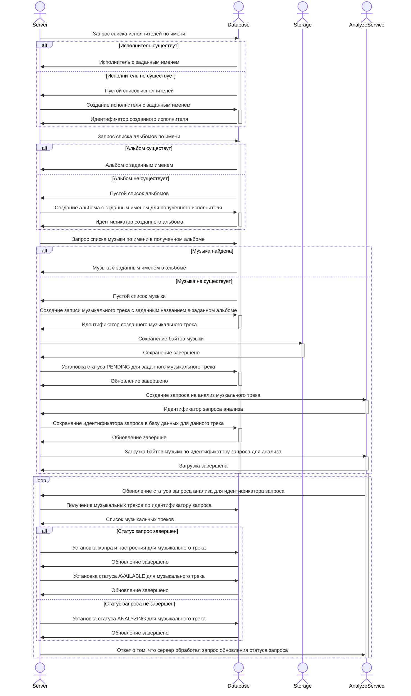

```mermaid
sequenceDiagram
actor Server
actor Database
actor Storage;
actor AnalyzeService;

Server->>Database: Запрос списка исполнителей по имени
activate Database

alt Исполнитель существут
    Database->>Server: Исполнитель с заданным именем
else Исполнитель не существует
    Database->>Server: Пустой список исполнителей
    Server->>Database: Создание исполнителя с заданным именем
    activate Database
    Database->>Server: Идентификатор созданного исполнителя
    deactivate Database
end
deactivate Database

Server->>Database: Запрос списка альбомов по имени
activate Database

alt Альбом существут
    Database->>Server: Альбом с заданным именем
else Альбом не существует
    Database->>Server: Пустой список альбомов
    Server->>Database: Создание альбома с заданным именем для полученного исполнителя
    activate Database
    Database->>Server: Идентификатор созданного альбома
    deactivate Database
end
deactivate Database

activate Database
Server->>Database: Запрос списка музыки по имени в полученном альбоме

alt Музыка найдена
    Database->>Server: Музыка с заданным именем в альбоме
else Музыка не существует
    Database->>Server: Пустой список музыки
    Server->>Database: Создание записи музыкального трека с заданным названием в заданном альбоме
    activate Database
    Database->>Server: Идентификатор созданного музыкального трека
    deactivate Database
    Server->>Storage: Сохранение байтов музыки
    activate Storage
    Storage->>Server: Сохранение завершено
    deactivate Storage
    Server->>Database: Установка статуса PENDING для заданного музыкального трека
    activate Database
    Database->>Server: Обновление завершено
    deactivate Database
    Server->>AnalyzeService: Создание запроса на анализ музкального трека
    activate AnalyzeService
    AnalyzeService->>Server: Идентификатор запроса анализа
    deactivate AnalyzeService
    Server->>Database: Сохранение идентификатора запроса в базу данных для данного трека
    activate Database
    Database->>Server: Обновление завершне
    deactivate Database
    Server->>AnalyzeService: Загрузка байтов музыки по идентификатору запроса для анализа
    activate AnalyzeService
    AnalyzeService->>Server: Загрузка завершена
    deactivate AnalyzeService
end
deactivate Database

activate AnalyzeService
loop
AnalyzeService->>Server: Обвноление статуса запроса анализа для идентификатора запроса
Server->>Database: Получение музыкальных треков по идентификатору запроса
Database->>Server: Список музыкальных треков
alt Статус запрос завершен
    Server->>Database: Установка жанра и настроения для музыкального трека
    Database->>Server: Обновление завершено
    Server->>Database: Установка статуса AVAILABLE для музыкального трека
    Database->>Server: Обновление завершено
else Статус запроса не завершен
    Server->>Database: Установка статуса ANALYZING для музыкального трека
    Database->>Server: Обновление завершено
end
Server->>AnalyzeService: Ответ о том, что сервер обработал запрос обновления статуса запроса
end
deactivate AnalyzeService

```
